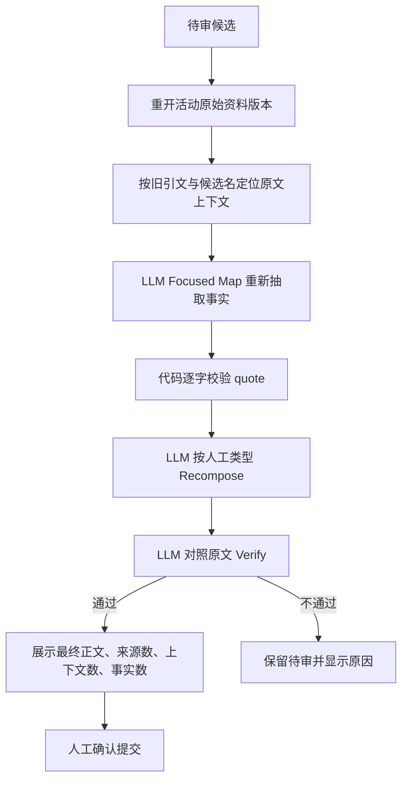

# LLM-first 语义架构

## 原则

ExampleProject 将“理解内容”和“可靠执行”分为两层：

- **模型负责语义**：总结、提炼、分类、消歧、价值判断、重复与矛盾判断、关系识别、内容重组、成熟度与时效判断、助手意图路由。
- **代码负责工程**：文件解析、无损分段、哈希、逐字引文校验、结构化 schema、权限、状态机、队列、事务、幂等、固定页面契约、来源路径计数和索引派生。

代码不得用关键词、字数、相似度阈值、编辑距离、固定天数或名称后缀替代模型的语义结论。模型失败时应进入失败、待审或人工选择状态，不得静默采用工程层猜测。

## 语义阶段

| 场景 | 模型阶段 | 代码责任 |
|---|---|---|
| 原始资料入库 | Map、Normalize、Plan、双重 Critic、Compose、Questions、Verify | 解析、引文存在性、事实白名单、两来源门禁、提交与派生任务 |
| 待审候选 | Focused Map、Recompose、Verify | 重开活动原始版本、定位原文上下文、校验引文、预览令牌与提交 |
| 实体身份 | Disambiguate | 确认模型建议的目标页确实存在 |
| 页面整理 | Summary and Type | 内容哈希幂等、frontmatter 写入 |
| 页面合并 | Semantic Merge | 预条件、归档、引用重写、索引任务 |
| 图谱 | Entity and Relation Extraction | 固定关系词表、目标存在性和边落库 |
| Dream Cycle | Deadlink Type、Page Pair Audit、Page Health | 死链存在性、候选召回、报告状态和批量执行 |
| 实体维护 | Maturity Decision | 引用收集、证据哈希和固定实体骨架 |
| 助手 | Route、Tool Decision、RAG Synthesis | 权限、工具 schema、审批、执行与撤销 |

## 待审原文再提炼

旧草稿不作为再提炼输入。检索结果只用于发现已有页面、补双链和去重，不得作为事实来源。

## 确定性业务规则

- 自动新建概念或实体页，必须至少有两个不同 `原始资料/` 路径各自提供有效事实。
- 同一路径的新版本仍只计一个来源。
- 引文必须逐字存在于对应原文上下文。
- 实体页固定为 `当前理解 -> 相关页面 -> 时间线`；概念页不强制时间线。
- 关系只有在类型合法、证据合法且目标页已存在或本批确定落地时才能提交。
- 忽略只关闭本次候选；未来再次出现时仍运行完整流程。

## 审计

所有结构化语义阶段通过 `runSemanticStage` 调用，并写入 `semantic_events`：

- `scope/ref_id/stage/model_tag` 标识业务阶段；
- `input_hash` 标识输入版本；
- `status/output/error/duration_ms` 记录成功、失败、结构化输出和耗时。

入库阶段同时保留 `ingest_audit`、`ingest_facts`、`source_versions` 与 `page_contributions`，用于从原始资料版本追溯到事实、页面贡献和最终投影。
